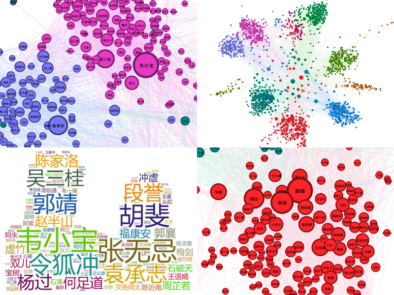
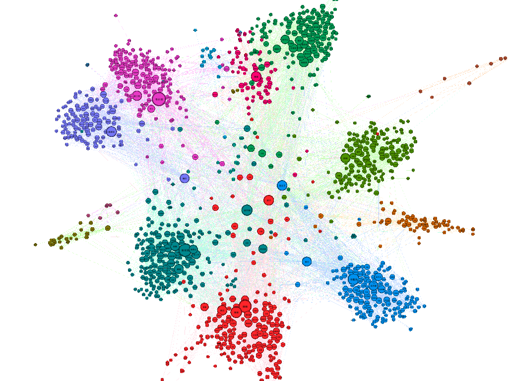
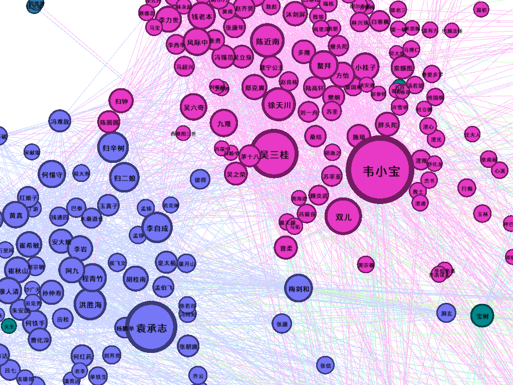
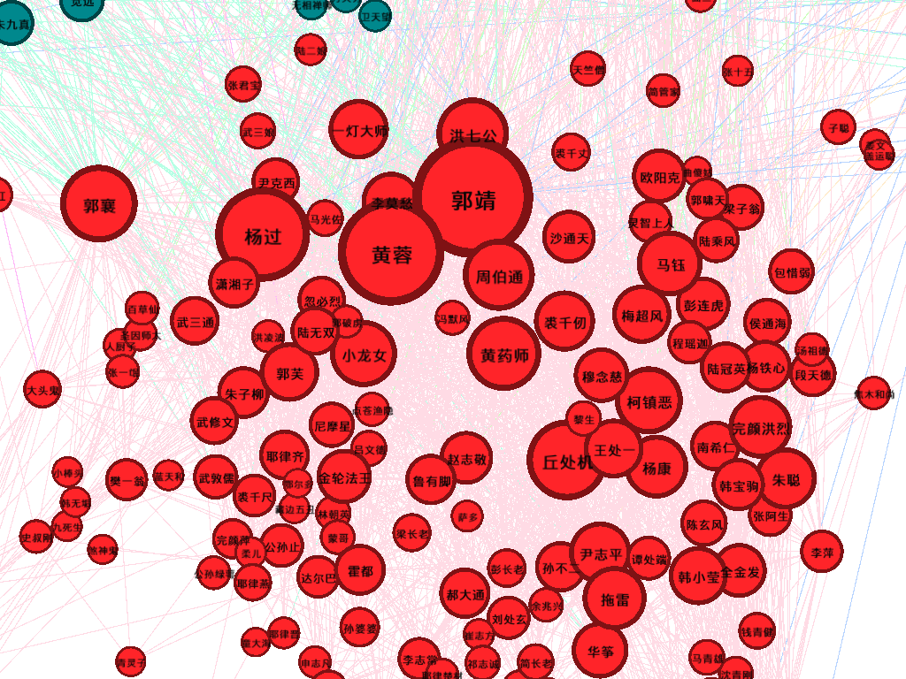
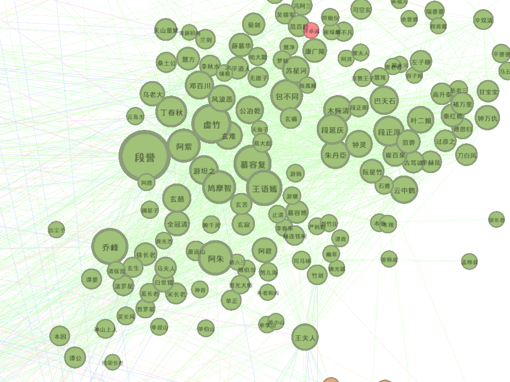

# 金庸的江湖 / JinYong's JiangHu

## Introduction

数据集包括金庸的14部小说（飞雪连天射白鹿，笑书神侠倚碧鸳）以及手动标注的小说人物名列表文件（/input/people_list_name.txt）。

基于此数据集，分析小说人物关系，包括PageRank计算，社区发现等。

## Development Environment & Tools

+ Ubuntu Kylin 15.10
+ [IntelliJ IDEA Community Edition 2016.1](https://www.jetbrains.com/idea/download/#section=linux)
+ Java / [JDK1.7.0_79](http://www.oracle.com/technetwork/java/javase/downloads/jdk7-downloads-1880260.html)
+ MapReduce / [Apache Hadoop 2.7.2](http://hadoop.apache.org/)
+ NLP: Segmentation / [ansj_seg5.0.0](https://github.com/NLPchina/ansj_seg)
+ Data Visualization: Word Cloud / [Tagxedo](http://www.tagxedo.com/), Graph Viz / [Gephi](https://gephi.org/)

## Run

### Arguments for Standalone

> $java -jar JinYong\'sJiangHu \<character_list\> \<novels\> \<out\> [\<debug\> \<timer\>]

examples:

> $java -jar JinYong\'sJiangHu ./input/people_name_list.txt ./input/novels/ ./output/Standalone false true

> $java -jar JinYong\'sJiangHu ./inputSample/people_name_list.txt ./inputSample/novels/

### Arguments for MapReduce / Pseudo Distribution

> <character_list> <novels> <out>

### Argumetns for MapReduce / Cluster

>

## Last: Data Visualization

### PageRank - Word Cloud

阴阳八卦 Word Cloud

郭靖/黄蓉 Word Cloud

### CommunityGraph - Graph Viz

整体图

局部图1

局部图2

局部图3

